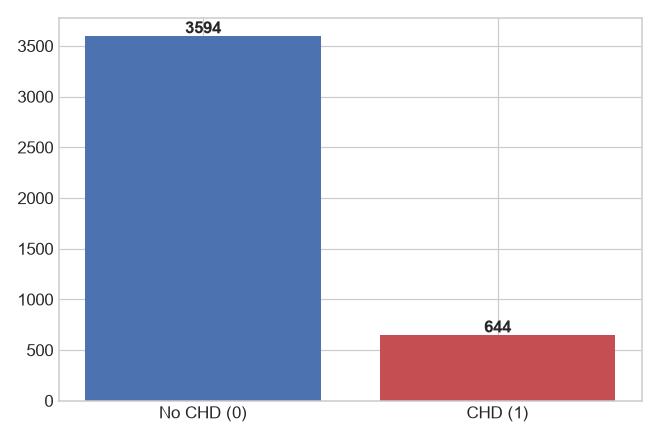
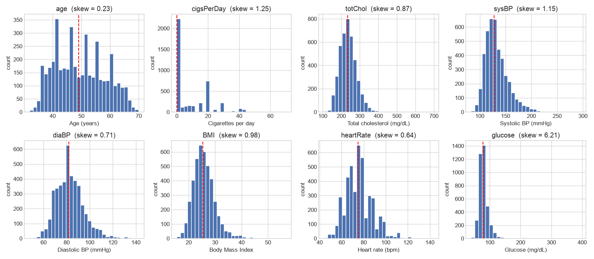
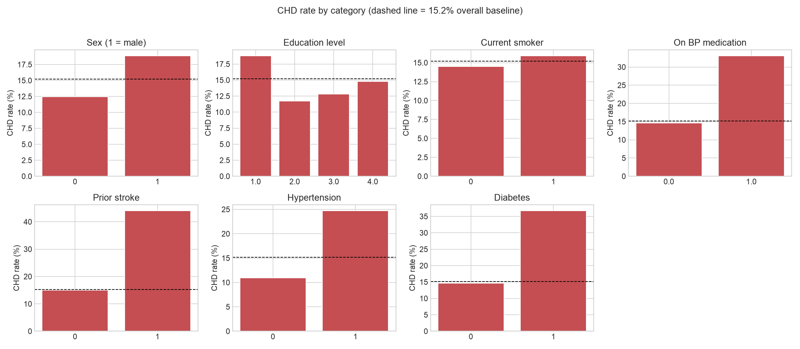
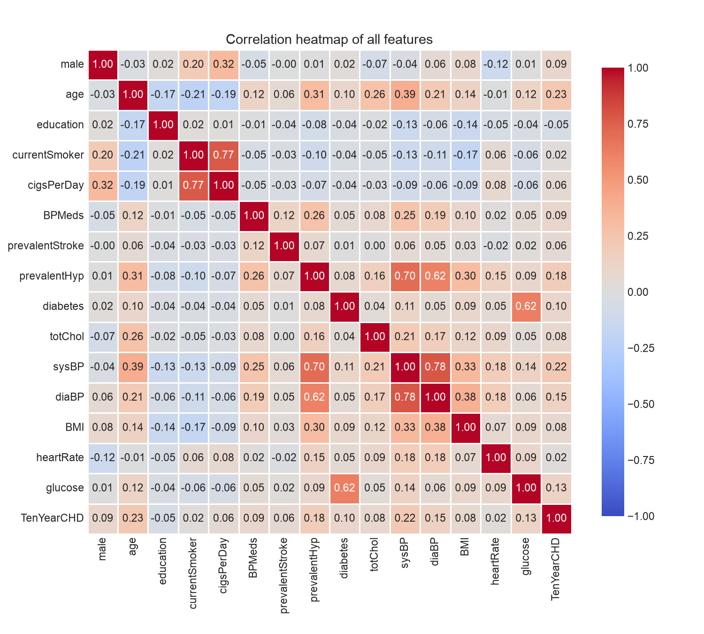
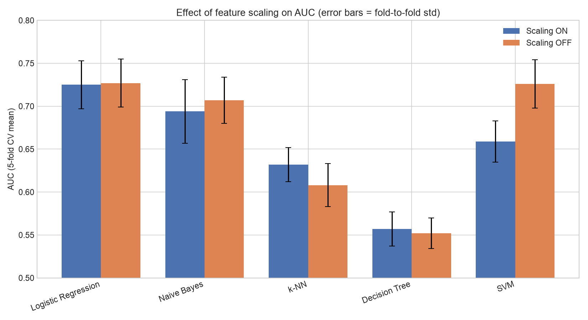
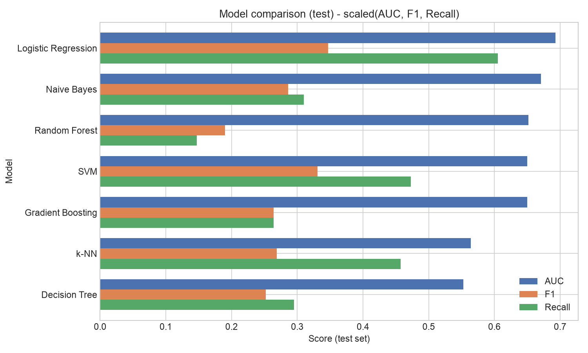
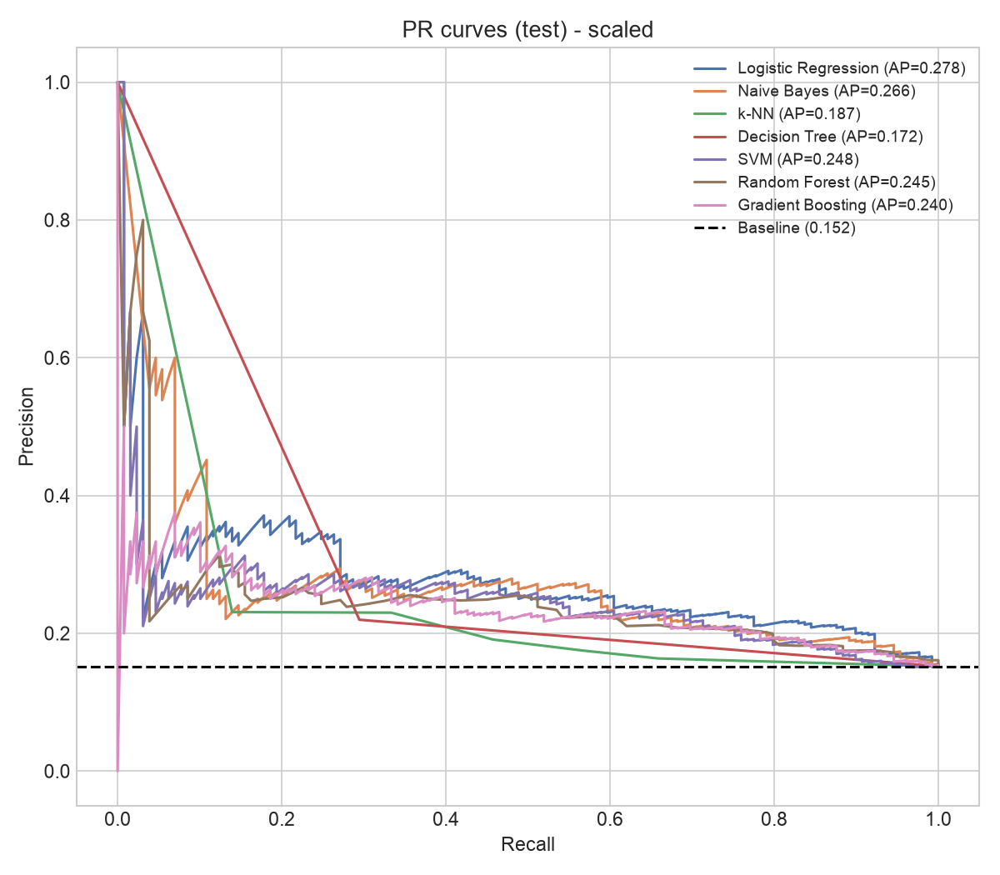
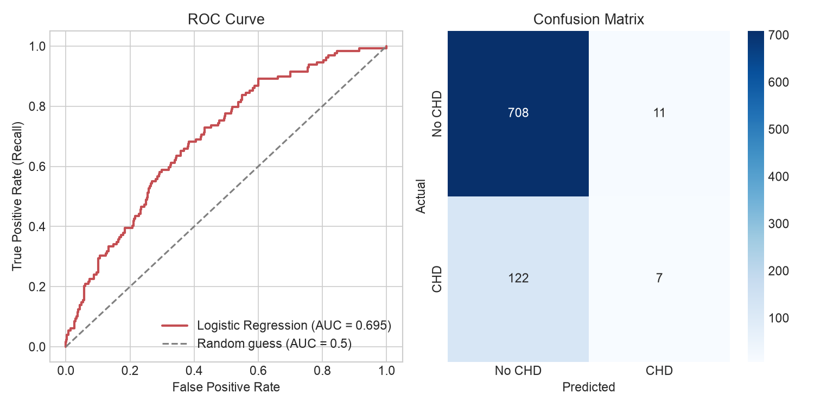
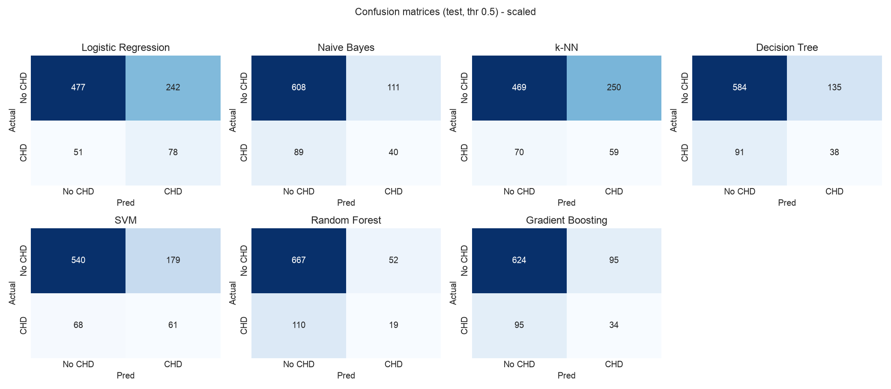

# 🫀 Comparative Study of Machine Learning Models for Cardiovascular Disease (CVD) Prediction

[](https://www.python.org/)
[](https://jupyter.org/)
[](https://scikit-learn.org/)
[](https://imbalanced-learn.org/)
[](https://www.kaggle.com/datasets/aasheesh200/framingham-heart-study-dataset)
[](https://mbust.edu.np/)
[](LICENSE)

> **Academic Project — Machine Learning Final Assignment**  
> **Course:** Machine Learning  
> **Author:** [Yalamber Ingnam](https://github.com/YalamberIngnam)  
> **Instructor:** Prof. Mamta Bhattarai Lamsal  
> **Institution:** [Madan Bhandari University of Science and Technology (MBUST)](https://mbust.edu.np/), Chitlang, Nepal  
> **Date:** September 2026  

---

## 📌 Executive Summary

Cardiovascular diseases (CVDs) are the leading cause of mortality worldwide, claiming an estimated **17.9 million lives annually** (World Health Organization). Early, non-invasive assessment of 10-year coronary heart disease (CHD) risk provides clinicians with actionable diagnostic insights to implement preventive lifestyle and pharmacological interventions.

This project presents a rigorous comparative benchmark of **seven supervised machine learning algorithms** on the famous **Framingham Heart Study dataset** ($N = 4,238$). Special emphasis is placed on:
- **Strict Data Leakage Prevention** via encapsulated `scikit-learn` `ColumnTransformer` and `imblearn` `Pipeline` architectures.
- **Handling Severe Class Imbalance** (~$84.8\%$ non-risk vs. ~$15.2\%$ CHD incident) using Synthetic Minority Over-sampling Technique (**SMOTE**) and Cost-Sensitive Learning.
- **Systematic Feature Scaling Analysis** (Standardization **ON** vs. **OFF**) across linear, distance-based, probabilistic, and ensemble models.
- **Clinical Metric Prioritization**: In medical screening, **False Negatives are fatal**; thus, models are evaluated primarily on **Sensitivity / Recall**, **ROC-AUC**, and **PR-AUC** rather than misleading raw accuracy.

---

## 📑 Table of Contents

- [🫀 Comparative Study of Machine Learning Models for Cardiovascular Disease (CVD) Prediction](#-comparative-study-of-machine-learning-models-for-cardiovascular-disease-cvd-prediction)
  - [📌 Executive Summary](#-executive-summary)
  - [📑 Table of Contents](#-table-of-contents)
  - [🩺 Dataset Description \& Clinical Glossary](#-dataset-description--clinical-glossary)
    - [Feature Dictionary](#feature-dictionary)
    - [Missing Value Audit \& Treatment Strategy](#missing-value-audit--treatment-strategy)
  - [📊 Exploratory Data Analysis (EDA) Insights](#-exploratory-data-analysis-eda-insights)
    - [1. Severe Class Imbalance](#1-severe-class-imbalance)
    - [2. Feature Distributions \& Skewness](#2-feature-distributions--skewness)
    - [3. Categorical Risk Drivers](#3-categorical-risk-drivers)
    - [4. Correlation Analysis \& Collinearity](#4-correlation-analysis--collinearity)
  - [⚙️ Preprocessing \& Anti-Leakage Architecture](#️-preprocessing--anti-leakage-architecture)
  - [🤖 Machine Learning Algorithms Benchmarked](#-machine-learning-algorithms-benchmarked)
  - [📈 Experimental Results \& Benchmark Comparison](#-experimental-results--benchmark-comparison)
    - [1. 5-Fold Stratified Cross-Validation Benchmark](#1-5-fold-stratified-cross-validation-benchmark)
    - [2. Feature Scaling Experiment: ON vs. OFF](#2-feature-scaling-experiment-on-vs-off)
    - [3. Held-Out Test Set Performance ($N = 848$)](#3-held-out-test-set-performance-n--848)
    - [4. Precision-Recall \& Confusion Matrix Evaluation](#4-precision-recall--confusion-matrix-evaluation)
  - [💡 Clinical Discussion \& Key Findings](#-clinical-discussion--key-findings)
  - [📁 Repository Structure](#-repository-structure)
  - [🚀 Getting Started \& Reproducibility](#-getting-started--reproducibility)
    - [Prerequisites](#prerequisites)
    - [Installation \& Setup](#installation--setup)
    - [Running the Notebook](#running-the-notebook)
  - [📚 References \& Acknowledgments](#-references--acknowledgments)

---

## 🩺 Dataset Description & Clinical Glossary

The dataset originates from the ongoing **Framingham Heart Study**, accessible on Kaggle via [Framingham Heart Study Dataset](https://www.kaggle.com/datasets/aasheesh200/framingham-heart-study-dataset). It contains $4,238$ patient records with $15$ baseline clinical, demographic, and behavioral features observed over a 10-year follow-up period.

### Feature Dictionary

| Feature | Category | Data Type | Description | Clinical Context & Normal Values |
| :--- | :--- | :--- | :--- | :--- |
| `male` | Demographic | Binary | Biological sex | `1` = Male; `0` = Female |
| `age` | Demographic | Numerical | Age at examination | $32 - 70$ years |
| `education` | Demographic | Categorical | Highest educational level | $1$ = Some High School, $2$ = High School/GED, $3$ = Some College, $4$ = College Degree |
| `currentSmoker` | Behavioral | Binary | Smoking status | `1` = Active Smoker; `0` = Non-smoker |
| `cigsPerDay` | Behavioral | Numerical | Smoking intensity | Cigarettes per day ($0 - 70$) |
| `BPMeds` | Medical History | Binary | Blood pressure medication | `1` = On anti-hypertensive medication; `0` = Not on medication |
| `prevalentStroke`| Medical History | Binary | History of stroke (CVA) | `1` = Prior stroke history; `0` = No stroke history |
| `prevalentHyp` | Medical History | Binary | Clinical hypertension | `1` = Hypertensive; `0` = Normotensive |
| `diabetes` | Medical History | Binary | Diagnosed diabetes | `1` = Diabetic; `0` = Non-diabetic |
| `totChol` | Laboratory | Numerical | Total serum cholesterol | mg/dL (Desirable: $< 200\text{ mg/dL}$) |
| `sysBP` | Physical Exam | Numerical | Systolic blood pressure | mm Hg (Normal: $< 120\text{ mm Hg}$) |
| `diaBP` | Physical Exam | Numerical | Diastolic blood pressure | mm Hg (Normal: $< 80\text{ mm Hg}$) |
| `BMI` | Physical Exam | Numerical | Body Mass Index | $\text{kg/m}^2$ (Normal: $18.5 - 24.9\text{ kg/m}^2$) |
| `heartRate` | Physical Exam | Numerical | Resting pulse | Beats per minute (Normal: $60 - 100\text{ bpm}$) |
| `glucose` | Laboratory | Numerical | Fasting blood glucose | mg/dL (Normal fasting: $70 - 99\text{ mg/dL}$) |
| `TenYearCHD` | **Target** | Binary | 10-year incident CHD | **`1` = Positive (CHD Event); `0` = Negative (No CHD)** |

### Missing Value Audit & Treatment Strategy

Missing data was systematically inspected across all features. Rather than dropping records (which would discard up to $15\%$ of the dataset), domain-appropriate imputation strategies were integrated directly inside the cross-validation folds:

| Feature | Missing Count | Missing Rate (%) | Imputation Strategy |
| :--- | :---: | :---: | :--- |
| `glucose` | 388 | 9.15% | **Median Imputation** (Robust against heavy right skewness) |
| `education` | 105 | 2.48% | **Mode (Most Frequent) Imputation** |
| `BPMeds` | 53 | 1.25% | **Mode (Most Frequent) Imputation** |
| `totChol` | 50 | 1.18% | **Median Imputation** |
| `cigsPerDay` | 29 | 0.68% | **Median Imputation** |
| `BMI` | 19 | 0.45% | **Median Imputation** |
| `heartRate` | 1 | 0.02% | **Median Imputation** |

---

## 📊 Exploratory Data Analysis (EDA) Insights

### 1. Severe Class Imbalance
The dataset exhibits significant target class asymmetry:
- **No CHD (`0`)**: $3,594$ patients ($84.80\%$)
- **Incident CHD (`1`)**: $644$ patients ($15.20\%$)
- *Imbalance Ratio:* $\approx 5.6 : 1$. A naive baseline predicting all zeros achieves $84.8\%$ accuracy while failing to identify a single high-risk patient.

<p align="center">
  
</p>

---

### 2. Feature Distributions & Skewness
Distributions of continuous biometric variables reveal significant positive skewness, notably in `glucose` ($\text{skew} = 6.21$) due to extreme diabetic outliers ($> 300\text{ mg/dL}$), as well as `sysBP` ($\text{skew} = 0.98$) and `cigsPerDay` ($\text{skew} = 1.25$).

<p align="center">
  
</p>

---

### 3. Categorical Risk Drivers
Patients diagnosed with pre-existing risk conditions show stark increases in 10-year CHD incidence compared to the $15.2\%$ baseline population average:
- **Prior Stroke History (`prevalentStroke = 1`)**: $44.0\%$ CHD rate
- **Pre-existing Diabetes (`diabetes = 1`)**: $36.9\%$ CHD rate
- **Hypertension (`prevalentHyp = 1`)**: $23.9\%$ CHD rate
- **Biological Sex (`male = 1`)**: $18.9\%$ CHD rate (vs. $12.4\%$ in females)

<p align="center">
  
</p>

---

### 4. Correlation Analysis & Collinearity
- **Strongest Predictors of CHD**: `age` ($r = 0.225$), `sysBP` ($r = 0.216$), `prevalentHyp` ($r = 0.178$), `diaBP` ($r = 0.145$), and `glucose` ($r = 0.122$).
- **Collinear Feature Pairs**: Systolic and Diastolic Blood Pressure (`sysBP` vs. `diaBP`, $r = 0.78$), and Smoking Status vs. Cigarette Volume (`currentSmoker` vs. `cigsPerDay`, $r = 0.77$).

<p align="center">
  
</p>

---

## ⚙️ Preprocessing & Anti-Leakage Architecture

To ensure valid generalization and prevent **data leakage**, all transformation parameters (median values, modes, scaler means/variances, and one-hot encoder categories) were fitted exclusively on training folds and subsequently applied to test folds.

```
                      Raw Clinical Data (N = 4,238)
                                    │
                                    ▼
                 ┌──────────────────────────────────────┐
                 │  Stratified 80/20 Train-Test Split   │
                 └──────────────────┬───────────────────┘
                                    │
         ┌──────────────────────────┴──────────────────────────┐
         ▼                                                     ▼
Train Partition (N = 3,390)                             Held-out Test (N = 848)
         │                                                     │
         ▼                                                     │
┌──────────────────────────────────────────────┐               │
│         Scikit-Learn ColumnTransformer       │               │
│  - Continuous: SimpleImputer (median)        │               │
│                + StandardScaler (optional)   │               │
│  - Binary:     SimpleImputer (mode)          │               │
│  - Categorical:SimpleImputer (mode)          │               │
│                + OneHotEncoder(ignore)       │               │
└──────────────────────┬───────────────────────┘               │
                       │ (Fit on Train)                        │ (Transform Test)
                       ▼                                       │
┌──────────────────────────────────────────────┐               │
│       Synthetic Minority Over-sampling       │               │
│             (SMOTE - Train Only)             │               │
└──────────────────────┬───────────────────────┘               │
                       │ Balanced Features                     │
                       ▼                                       ▼
┌──────────────────────────────────────────────┐    ┌────────────────────┐
│      5-Fold Stratified Cross-Validation      │───▶│ Final Test Score   │
│      & Model Parameter Calibration           │    │ & PR / ROC Analysis│
└──────────────────────────────────────────────┘    └────────────────────┘
```

---

## 🤖 Machine Learning Algorithms Benchmarked

We benchmarked seven diverse classification paradigms:

1. **Logistic Regression (`LogisticRegression`)**: Linear parametric classifier optimized for interpretable log-odds and well-calibrated probabilistic risk scores.
2. **Gaussian Naive Bayes (`GaussianNB`)**: Probabilistic generative classifier assuming conditional feature independence given the class.
3. **$k$-Nearest Neighbors (`KNeighborsClassifier`)**: Non-parametric, distance-based instance learner ($k = 5$, Euclidean distance).
4. **Decision Tree (`DecisionTreeClassifier`)**: Non-linear, rule-based recursive partitioning algorithm with Gini impurity splitting.
5. **Support Vector Machine (`SVC`, RBF Kernel)**: Maximal margin hyperplane classifier with non-linear radial basis function kernel mapping and probability calibration.
6. **Random Forest (`RandomForestClassifier`)**: Ensemble bagging model aggregating decorrelated bootstrap decision trees ($n = 100$).
7. **Gradient Boosting (`GradientBoostingClassifier`)**: Ensemble sequential boosting algorithm optimizing pseudo-residuals through gradient descent.

---

## 📈 Experimental Results & Benchmark Comparison

### 1. 5-Fold Stratified Cross-Validation Benchmark
All models were evaluated under identical 5-fold stratified cross-validation splits using **SMOTE** balancing and **StandardScaler** on the training folds.

| Rank | Model | Accuracy | Precision | Recall (Sensitivity) | F1-Score | ROC-AUC (Mean ± Std) |
| :---: | :--- | :---: | :---: | :---: | :---: | :---: |
| 🥇 | **Logistic Regression** | 0.673 | 0.269 | **0.670** | **0.384** | **0.725 ± 0.028** |
| 🥈 | **Gradient Boosting** | 0.790 | 0.324 | 0.351 | 0.337 | **0.700 ± 0.023** |
| 🥉 | **Gaussian Naive Bayes** | 0.776 | 0.312 | 0.392 | 0.347 | **0.694 ± 0.037** |
| 4 | **Random Forest** | **0.818** | **0.336** | 0.198 | 0.248 | **0.683 ± 0.011** |
| 5 | **Support Vector Machine (SVM)**| 0.693 | 0.245 | 0.485 | 0.325 | **0.659 ± 0.024** |
| 6 | **$k$-Nearest Neighbors ($k$-NN)** | 0.655 | 0.234 | 0.559 | 0.330 | **0.632 ± 0.020** |
| 7 | **Decision Tree** | 0.731 | 0.221 | 0.307 | 0.257 | **0.557 ± 0.020** |

---

### 2. Feature Scaling Experiment: ON vs. OFF
A controlled experiment was conducted across all models to quantify the empirical impact of feature standardization ($\mu = 0, \sigma = 1$).

| Model | AUC (Scaling ON) | AUC (Scaling OFF) | $\Delta$ AUC | Typical Fold Std | Sensitivity to Scaling |
| :--- | :---: | :---: | :---: | :---: | :--- |
| **$k$-NN** | **0.632** | 0.608 | **+0.024** | 0.022 | **High**: Euclidean distances distorted by raw units |
| **SVM (RBF)** | 0.659 | 0.726 | -0.067 | 0.026 | **High**: Kernel width $\gamma$ interacts with feature scale |
| **Logistic Regression** | 0.725 | 0.727 | -0.002 | 0.028 | **Negligible**: L-BFGS converges equivalently |
| **Naive Bayes** | 0.694 | 0.707 | -0.013 | 0.032 | **Negligible**: Calculates per-feature Gaussians |
| **Decision Tree** | 0.557 | 0.552 | +0.005 | 0.019 | **None**: Monotonic threshold invariance |

<p align="center">
  
</p>

---

### 3. Held-Out Test Set Performance ($N = 848$)
Final evaluation on the untouched $20\%$ test partition ($719$ negative, $129$ positive cases):

| Model | Feature Scaling | Accuracy | Precision | Recall (Sensitivity) | F1-Score | ROC-AUC |
| :--- | :---: | :---: | :---: | :---: | :---: | :---: |
| **Logistic Regression** | **ON** | 0.654 | 0.244 | **0.605** | **0.347** | **0.693** |
| **Logistic Regression** | **OFF** | 0.666 | 0.252 | **0.605** | **0.355** | **0.693** |
| **Gaussian Naive Bayes** | **ON** | 0.764 | 0.265 | 0.310 | 0.286 | **0.671** |
| **Gaussian Naive Bayes** | **OFF** | 0.769 | 0.266 | 0.295 | 0.279 | **0.669** |
| **Random Forest** | **ON** | **0.809** | 0.268 | 0.147 | 0.190 | **0.652** |
| **SVM (RBF)** | **ON** | 0.709 | 0.254 | 0.473 | 0.331 | **0.650** |
| **Gradient Boosting** | **ON** | 0.776 | 0.264 | 0.264 | 0.264 | **0.650** |
| **Gradient Boosting** | **OFF** | **0.823** | **0.328** | 0.155 | 0.211 | **0.666** |
| **$k$-NN** | **ON** | 0.623 | 0.191 | 0.457 | 0.269 | **0.564** |
| **Decision Tree** | **ON** | 0.733 | 0.220 | 0.295 | 0.252 | **0.553** |

<p align="center">
  
</p>

---

### 4. Precision-Recall & Confusion Matrix Evaluation

<p align="center">
  
  
</p>

<p align="center">
  
</p>

---

## 💡 Clinical Discussion & Key Findings

1. **The "Accuracy Paradox" in Clinical Diagnostics**:
   - Ensemble algorithms like **Random Forest** ($80.9\%$) and **Gradient Boosting** ($82.3\%$) achieved high raw accuracy but suffered from severe under-diagnosis, catching only $14.7\% - 26.4\%$ of patients who actually experienced a CHD event (high False Negative rate).
   - In clinical screening, missing a high-risk patient is far more detrimental than performing a secondary confirmatory check on a false positive.

2. **Superiority of Logistic Regression + SMOTE**:
   - **Logistic Regression paired with SMOTE** was the top-performing model across both 5-fold CV ($\text{AUC} = 0.725$, $\text{Recall} = 0.670$) and the held-out test set ($\text{AUC} = 0.693$, $\text{Recall} = 0.605$).
   - On the test set, it successfully detected **$78$ out of $129$ true cardiovascular cases**, outperforming every complex non-linear ensemble in clinical sensitivity.

3. **Key Physiological Biomarkers Driving Risk**:
   - Primary drivers of 10-year CHD probability identified across models include:
     1. **Age** (advanced baseline age strongly scales vascular risk).
     2. **Systolic Blood Pressure (`sysBP`)** and **Hypertension (`prevalentHyp`)**.
     3. **Daily Smoking Volume (`cigsPerDay`)**.
     4. **Fasting Blood Glucose (`glucose`)** and diagnosed **Diabetes**.

---

## 📁 Repository Structure

```
.
├── Comparative study of different ML for  CVD predictions.ipynb  # Primary Jupyter Notebook
├── framingham.csv                                               # Framingham Heart Study Dataset
├── README.md                                                    # Project Documentation & Report
├── requirements.txt                                             # Python Dependencies
│
├── 📊 Generated Visualizations & Plots:
│   ├── target_distribution.png                                  # Target class balance
│   ├── feature_distributions.png                                # Continuous feature distributions
│   ├── categorical_rates_grid.png                               # Categorical CHD incidence breakdown
│   ├── correlation_heatmap.png                                  # Feature correlation matrix
│   ├── scaling_experiment.png / .pdf                            # Feature scaling CV experiment
│   ├── A1_bars_scaled.png / .pdf                                # Model comparison bars (scaled)
│   ├── A1_bars_unscaled.png / .pdf                              # Model comparison bars (unscaled)
│   ├── A3_pr_scaled.png                                         # Precision-Recall curves (scaled)
│   ├── A3_pr_unscaled.png                                       # Precision-Recall curves (unscaled)
│   ├── A4_confusion_scaled.png / .pdf                           # Confusion matrix grid (scaled)
│   ├── A4_confusion_unscaled.png / .pdf                         # Confusion matrix grid (unscaled)
│   └── roc_and_confusion.png                                    # Logistic Regression ROC & Confusion
```

---

## 🚀 Getting Started & Reproducibility

### Prerequisites
- Python `3.9` or higher
- Jupyter Notebook or JupyterLab
- Git

### Installation & Setup

1. **Clone the repository:**
   ```bash
   git clone https://github.com/YalamberIngnam/CVD-prediction-using-Gradient-Boosting-and-6-other-algo-on-Farmingham-.git
   cd CVD-prediction-using-Gradient-Boosting-and-6-other-algo-on-Farmingham-
   ```

2. **Create and activate a virtual environment:**
   ```bash
   # Using venv
   python3 -m venv venv
   source venv/bin/activate  # On Windows: venv\Scripts\activate
   ```

3. **Install dependencies:**
   ```bash
   pip install -r requirements.txt
   ```

   *Alternatively, install manually:*
   ```bash
   pip install numpy pandas matplotlib seaborn scikit-learn imbalanced-learn jupyter
   ```

### Running the Notebook

Launch Jupyter Notebook and execute all cells:
```bash
jupyter notebook "Comparative study of different ML for  CVD predictions.ipynb"
```

---

## 📚 References & Acknowledgments

1. **Framingham Heart Study Dataset**: [Kaggle Dataset by Aasheesh](https://www.kaggle.com/datasets/aasheesh200/framingham-heart-study-dataset). Primary clinical study reference: Mahmood, S. S., Levy, D., Vasan, R. S., & Wang, T. J. (2014). *The Framingham Heart Study and the epidemiology of cardiovascular disease: a historical perspective.* The Lancet, 383(9921), 999-1008.
2. **SMOTE**: Chawla, N. V., Bowyer, K. W., Hall, L. O., & Kegelmeyer, W. P. (2002). *SMOTE: synthetic minority over-sampling technique.* Journal of Artificial Intelligence Research, 16, 267-297.
3. **Scikit-Learn**: Pedregosa, F., et al. (2011). *Scikit-learn: Machine Learning in Python.* Journal of Machine Learning Research, 12, 2825-2830.
4. **Academic Guidance**: Special thanks to **Prof. Mamta Bhattarai Lamsal** and the Faculty of Science and Technology at **Madan Bhandari University of Science and Technology (MBUST)** for curriculum support and feedback.

---

<p align="center">
  <sub>Developed by <b>Yalamber Ingnam</b> | MBUST, Chitlang, Nepal | September 2026</sub>
</p>
